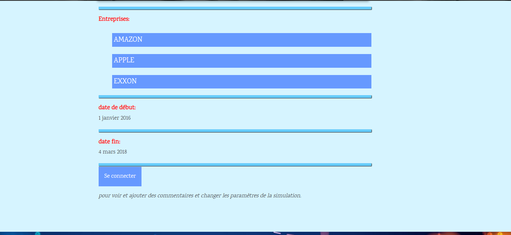

<h1>Project_par</h1>

<strong>Project_par</strong> is a portfolio optimization web application based on <strong>Markowitz's Modern Portfolio Theory</strong>. It allows users to simulate different investment portfolios and determine optimal allocations across a predefined set of companies, based on individual risk preferences. The app sources market data directly from the IEX API.

<h2>📊 How It Works</h2>

<ul>
  <li>The app pulls real-time data from IEX and processes it into a structured DataFrame.</li>
  <li>Missing data is handled and cleaned.</li>
  <li>Key statistics such as <strong>mean returns</strong> and <strong>covariance matrices</strong> are computed to construct portfolios.</li>
</ul>

Two key visualizations are provided:

<ol>
  <li><strong>Efficient Frontier (without risk-free assets)</strong> – illustrates the trade-off between risk and return.</li>
  <li><strong>Allocation Chart</strong> – shows recommended investment ratios based on your preferences:
    <ul>
      <li>Blue bars: for risk-averse investors (low variance).</li>
      <li>Red bars: for return-seeking investors (high expected return, higher risk).</li>
    </ul>
  </li>
</ol>

<h2>⚙️ Installation & Setup</h2>

<h3>1. Prerequisites</h3>
<ul>
  <li>Install <strong>Python 3</strong></li>
  <li>Ensure <code>pip</code> is added to your system’s environment variables</li>
</ul>

<h3>2. Install Required Libraries</h3>
<pre>
pip install dj-database-url Django gunicorn matplotlib numpy pandas psycopg2 pandas-datareader pbr plotly scipy whitenoise pillow
</pre>

<h3>3. Clone the Repository</h3>
<pre>
git clone &lt;repository-name&gt;
</pre>

<h3>4. Run the Django App</h3>
<pre>
python manage.py makemigrations
python manage.py migrate
python manage.py createsuperuser
python manage.py runserver
</pre>

Then open your browser and go to <a href="http://localhost:8000/admin">http://localhost:8000/admin</a>.

<h2>🛠 Admin Panel Setup</h2>

<ol>
  <li>
    Go to <strong>Choix actifs</strong> and click "Add choix actif". 
    Available companies:
    <ul>
      <li>AMAZON</li>
      <li>APPLE</li>
      <li>EXXON</li>
      <li>FORD</li>
      <li>GOOGLE</li>
      <li>WALMART</li>
    </ul>
    <em>Use uppercase letters with no spaces.</em>
  </li>
  <li>
    Upload logos if needed via the <code>media/logos</code> folder.
  </li>
  <li>
    Go to <strong>Simulations</strong> → "Add simulation". Add sample images/dates. For reference, see folders:
    <code>simulation/first</code> and <code>simulation/second</code>.
  </li>
</ol>

<h2>🌐 Web Interface</h2>

<ol>
  <li>Login using your admin credentials.</li>
  <li>Go to <strong>Simulation</strong> → "Changer paramètres".</li>
  <li>Enter new parameters and submit to view portfolio results.</li>
</ol>

<h2>🖼 Screenshots</h2>

   
   
   
 

<h2>📬 Contact</h2>

If you want to extend this project or modify it (e.g. to add more companies), feel free to contact me:

Email: <a href="mailto:sarroukh.issame@gmail.com?subject=Questions&body=Put%20your%20questions%20here">sarroukh.issame@gmail.com</a>

<h2>🙏 Thanks</h2>

Thank you for reading! I hope this project helps you better understand portfolio optimization.

<strong>– SARROUKH Issame</strong>

